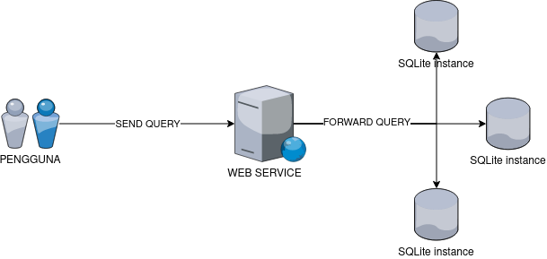
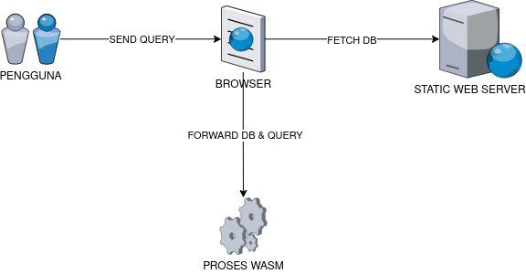

# Arsitektur Eksekusi Query pada Game Edukasi SQL

Use-case utama pada game (aplikasi) ini adalah pengguna dapat menuliskan query SQL untuk mendapatkan data ataupun respon seperti pada client basis data secara umum seperti pada PHPMyAdmin, Table Plus, mysql cli dan sebagainya. Agar dapat memenuhi kebutuhan tersebut diperlukan suatu teknologi yang dapat memungkinkan terjadinya eksekusi query SQL yang dituliskan pengguna. Adapun berikut terdapat dua solusi yang dapat diterapkan untuk kebutuhan tersebut.

## Berbasis Client-server

Dengan menggunakan solusi ini, kita dapat membangun sebuah layanan (service) berbasis client-server dengan membuat sebuah HTTP JSON API yang di dalamnya akan terdapat sebuah endpoint semisal `/execute`. Endpoint ini akan menerima HTTP request dengan body berisikan query dari pengguna serta beberapa data tambahan lainnya dan kemudian layanan ini akan memproses query SQL dengan mengeksekusinya secara langsung ke dalam basis data yang ada di server melalui antarmuka (interface) pada bahasa pemrograman yang digunakan dalam pengembangan layanan.

Dengan alasan kepraktisan, basis data yang digunakan untuk mengeksekusi query pengguna adalah SQLite. Adapun SQLite adalah sebuah sistem manajemen basis data relasional (DBMS) yang bersifat self-contained, serverless, dan zero-configuration. SQLite merupakan salah satu basis data paling populer di dunia karena sifatnya yang ringan dan mudah digunakan. Basis data SQLite di simpan dalam bentuk sebuah berkas dengan ekstensi "db" ataupun "sqlite". Dengan memanfaatkan basis data SQLite yang berbasis berkas, kita dapat membuat basis data yang berbeda untuk tiap topik (materi) secara mudah.

Untuk mempermudah pemahamaan pada penjelasan di atas, dapat dilihat pada diagram berikut.



Pada diagram di atas, pengguna (di dalam aplikasi) akan mengirimkan query ke dalam web service ataupun endpoint tersendiri pada aplikasi yang kemudian query tersebut akan ditujukan dan dieksekusi pada basis data SQLite tertentu berdasarkan topik atau materi yang sedang dipelajari pengguna.

Adapun bentuk body request sederhana dari pengguna dapat berupa seperti berikut:

```json
{
  "topikId": 1,
  "type": "DML",
  "query:": "SELECT * FROM users"
}
```

Pada body request di atas, topik dibedakan berdasarkan id topik. Karena hasil dari sebuah query berbeda (tipe dari query berbeda seperti DML, DDL dan sebagainya) maka diperlukan tipe pembeda dari query agar dapat menyesuaikan output yang dikirim.

Selanjutnya server kemudian akan mengirimkan hasil proses eksekusi query SQL sebagai response. Adapun bentuk body response sederhana dari pengguna berupa seperti berikut:

```json
{
  "success": false,
  "error": "",
  "result": []
}
```

Pada body response di atas, `success` berupa sebuah value yang menandakan apakah query berhasil dijalankan atau tidak. Jika query gagal dieksekusi, value `success` akan menjadi false dan akan terdapat pesan `error` yang dapat digunakan untuk memproses tampilan error kepada pengguna. Value dari `result` berupa array dari hasil output query yang dapat disesuaikan kembali bergantung kepada jenis query yang dikirimkan.

Kelebihan dari penggunaan aristektur client-server adalah:

- Karena menggunakan server, maka browser tidak terbebani dengan proses tambahan dan aplikasi akan lebih cepat memuat halaman.

- Mudah dalam mengatur struktur basis data dan bisa menggunakan DMBS lainnya seperti MySQL, PostgreSQL dan sebagainya.

Kekurangan dari penggunaan aristektur client-server adalah:

- Terdapat delay round-trip server ketika melakukan eksekusi query SQL.

- Kesulitan dalam pengembangan karena terdapat tambahan layanan.

## Berbasis client dengan WASM

Dengan solusi ini kita dapat mengeksekusi query SQL secara langsung di dalam browser tanpa memerlukan server ataupun layanan tambahan dengan menggunakan teknologi WASM. Adapun WASM (WebAssembly) adalah standar instruksi biner yang dirancang untuk memungkinkan perangkat lunak dikompilasi dari berbagai bahasa pemrograman untuk dijalankan dalam lingkungan web, secara aman dan cepat. WebAssembly berfungsi sebagai format bytecode untuk kode yang dapat dieksekusi di web, memberikan performa mendekati asli yang hampir setara dengan kode asli yang dijalankan langsung di mesin, tetapi dengan keamanan dan portabilitas yang biasanya diharapkan dari lingkungan web.

Untuk mempermudah penggunaan WASM sebagai kebutuhan eksekusi query SQL, akan digunakan salah satu pustaka seperti SQL.js. Adapun SQL.js adalah implementasi JavaScript dari SQLite, sebuah sistem manajemen basis data SQL ringan dan self-contained. SQL.js memungkinkan database SQLite untuk berjalan sepenuhnya di dalam browser atau dalam lingkungan JavaScript lainnya seperti Node.js tanpa perlu komunikasi dengan server eksternal. Hal ini memungkinkan aplikasi web atau skrip JavaScript untuk bekerja dengan database SQL sepenuhnya di sisi klien.

Untuk mempermudah pemahamaan pada penjelasan di atas, dapat dilihat pada diagram berikut.



Pada diagram di atas, pengguna akan menuliskan query yang kemudian akan diolah dan dieksekusi. Sebelum itu, basis data untuk tiap topik yang berbeda akan diambil (_fetch_) ke sebuah static web server. Kemudian berkas basis data akan dimuat ke dalam proses WASM dan query akan dieksekusi secara langsung di dalam browser. Adapun untuk bentuk request dan response dapat mengikuti pada arsitektur yang berbasis client-server seperti pada contoh sebelumnya.

Kelebihan dari penggunaan arsitektur WASM adalah:

- Kemudahan dalam pengembangan aplikasi karena tidak memerlukan pembuatan layanan tambahan.

- Kineja tinggi dan responsif karena tidak perlu round-trip ke server.

- Aplikasi dapat dihosting sebagai aplikasi static html.

Kekurangan dari penggunaan aristektur WASM adalah:

- Pengguna harus menggunakan browser yang mendukung WASM (kebanyakan pengguna sudah menggunakan browser versi terbaru).
